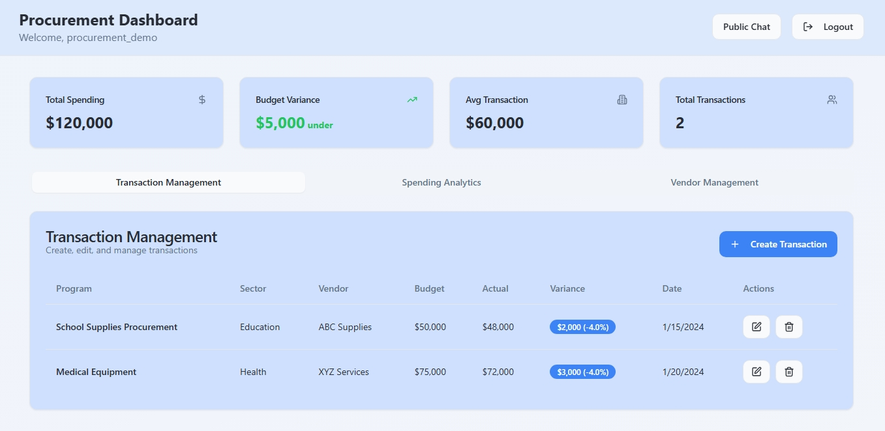

# TransparencyBot 🌍🤖

An **AI + Web3 powered accountability system** designed to promote transparency, good governance, and citizen engagement in the use of public funds.

TransparencyBot combines AI chat interfaces, Web3 verification, and community-driven reporting to fight corruption and ensure citizens can easily track how public funds are allocated and spent.

*Built for the AI + Web3 for Sustainable Innovation Hackathon*

## 🎯 Mission & Impact

TransparencyBot directly contributes to **UN Sustainable Development Goals (SDGs)**:

- **SDG 16 – Peace, Justice & Strong Institutions**: Promotes transparency, reduces corruption, and builds trust in governance
- **SDG 9 – Industry, Innovation & Infrastructure**: Harnesses emerging tech (AI + Web3) to strengthen digital public infrastructure  
- **SDG 10 – Reduced Inequalities**: Gives every citizen equal access to public fund usage data, empowering marginalized groups

## 🚀 Key Features

### 🤖 AI-Powered Chatbot
- Ask natural language questions like *"How were education funds used in Kampala in 2024?"*
- Get AI-enhanced, typo-tolerant, and structured responses
- Smart fuzzy matching for better user experience

### 📊 Citizen Reporting
- Anonymous reporting of suspected corruption or anomalies
- Secure logging of all reports
- Community-driven transparency initiatives

### 🔍 Anomaly Detection
- AI models automatically flag unusual spending patterns
- Analysis of procurement and financial reports
- Real-time monitoring of fund allocations

### ⛓️ Web3 Verification
- Immutable storage of critical reports and decisions on blockchain
- Tamper-proof audit trails
- Transparent verification system

### 👥 Role-Based Dashboards
- **Citizens**: Chatbot interface to ask questions & view fund usage
- **Auditors**: Dashboard to analyze anomalies, flagged reports, and trends
- **Procurement Officers**: Transparency tools for submitting reports and monitoring accountability

## 🛠️ Tech Stack

### Frontend
- **Framework**: React + Vite
- **Language**: TypeScript
- **UI Library**: shadcn/ui (Radix + Tailwind CSS)
- **Authentication**: Supabase Auth
- **State Management**: React Context (AuthContext)
- **Charts**: Recharts

### Backend
- **Database & Auth**: Supabase (PostgreSQL + Auth + Storage)
- **Serverless Functions**: Supabase Edge Functions (TypeScript)
  - `chatbot` → AI-enhanced Q&A
  - `detect-anomalies` → Automated anomaly detection
  - `submit-report` → Reporting workflow

### AI Integration
- **Hybrid Approach**: Rule-based responses + AI APIs
- **Knowledge Base**: `chatbot-responses.json` for baseline answers
- **NLP**: OpenAI API for natural language understanding & typo-tolerance
- **ML Models**: Embedded anomaly detection algorithms

### Web3 Integration
- **Blockchain Logging**: Immutable storage of key reports and corruption flags
- **Smart Contracts**: Transparent audit logs and verifiable timestamps

## 📐 System Architecture

```
┌─────────────┐    ┌─────────────────┐    ┌─────────────────┐
│   User      │───▶│  React Frontend │───▶│  Supabase Auth  │
└─────────────┘    └─────────────────┘    └─────────────────┘
                            │
                            ▼
                   ┌─────────────────┐
                   │ Chatbot Queries │
                   └─────────────────┘
                            │
                            ▼
            ┌─────────────────────────────────┐
            │  Supabase Edge Function         │
            │  (AI Processing + Fuzzy Match)  │
            └─────────────────────────────────┘
                            │
                            ▼
                   ┌─────────────────┐    ┌─────────────────┐
                   │ PostgreSQL DB   │───▶│ Web3 Blockchain │
                   │ (Supabase)      │    │ (Immutable Logs)│
                   └─────────────────┘    └─────────────────┘
```

## 🧑‍💻 Getting Started

### Prerequisites
- Node.js (>= 18.x)
- npm or pnpm
- Supabase CLI
- OpenAI API Key (optional)

### Installation

1. **Clone the repository**
   ```bash
   git clone https://github.com/cherubin-umuragwa/transparencybot.git
   cd transparencybot
   ```

2. **Install dependencies**
   ```bash
   npm install
   ```

3. **Set up Supabase**
   ```bash
   # Install Supabase CLI
   npm install -g supabase
   
   # Start local services
   supabase start
   ```

4. **Configure environment variables**
   
   Create a `.env` file:
   ```env
   VITE_SUPABASE_URL=http://localhost:54321
   VITE_SUPABASE_ANON_KEY=your-local-anon-key
   OPENAI_API_KEY=your-openai-api-key
   ```

5. **Run development server**
   ```bash
   npm run dev
   ```
   
   Frontend available at: http://localhost:3000

## 📸 Screenshots

### Homepage & Chatbot Interface

*Main landing page with AI-powered chatbot interface*


*Example of natural language queries and AI responses*

### Dashboards

*Auditor interface with transactions inspection*


*Auditor interface with anomaly detection*

### Reporting & Analytics

*Auditor interface with report reviewing*


*Reporting interface for citizens*

### Web3 Integration

*Procument interface with transactions management*


*Procument interface with spending analysis*


*Procument interface with vendors management*

## 👩‍🚀 User Journey

### 🏛️ Normal Citizen
1. Opens TransparencyBot in browser
2. Asks chatbot: *"Where did the healthcare funds for Kampala go in 2024?"*
3. Receives clear, structured response
4. Notices anomaly → clicks "Report Issue" → submits anonymous report

### 🔍 Auditor
1. Logs into Auditor Dashboard
2. Inspects the transactions
3. Reviews reports
4. Confirms flagged issues and logs verification on blockchain (_comimg soon_)

### 📋 Procurement Officer
1. Logs into Procurement Dashboard
2. Submits procurement reports
3. Ensures transparency by sharing approved budgets
4. Manages the vendors
5. Make transactions

## 🎥 Demo & Links

- 📺 [Watch Demo Video](https://youtu.be/GJMXyaJESbg?si=8Dz8RGut0AXPO-SV)
- 🌐 [Live Demo](Coming Soon)
- 📂 [GitHub Repository](https://github.com/cherubin-umuragwa/transparencybot.git)

## 🤝 Contributing

We welcome contributions! Here's how to get started:

1. Fork the repository
2. Create a feature branch (`git checkout -b feature/amazing-feature`)
3. Make your changes
4. Commit using [Conventional Commits](https://conventionalcommits.org/)
5. Push to the branch (`git push origin feature/amazing-feature`)
6. Open a Pull Request

Please read our [Contributing Guidelines](CONTRIBUTING.md) for more details.

## 📜 License

This project is licensed under the **MIT License**. See [LICENSE](LICENSE) for details.

## 👥 Team

Built by the **TransparencyBot Hackathon Team**:

- AI Engineers
- Web3 Developers  
- Software Engineers
- UI/UX Designers
- Community Activists

## 🔗 Related Projects

- [OpenGov API](https://github.com/opengov/api)
- [Blockchain Transparency Initiative](https://github.com/transparency-blockchain)
- [AI for Good Foundation](https://github.com/ai-for-good)

---

**TransparencyBot** - *Empowering citizens through AI-powered transparency* 🌟
